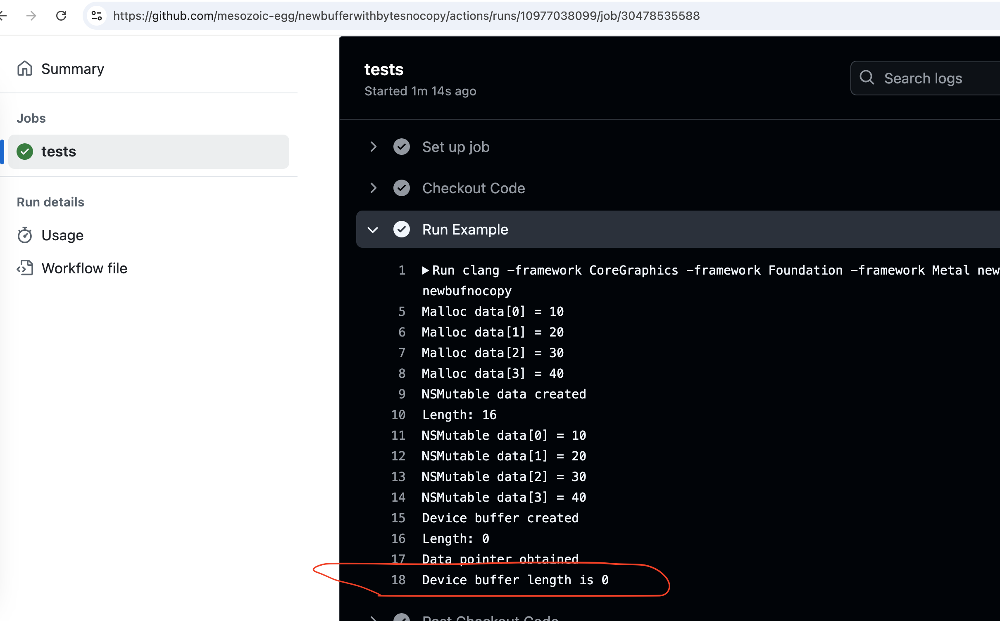

# Reproduceable example for newBufferWithBytesNoCopy

Local example that works

```
$ clang -framework CoreGraphics -framework Foundation -framework Metal newbufnocopy.m -o newbufnocopy && ./newbufnocopy
Malloc data[0] = 10
Malloc data[1] = 20
Malloc data[2] = 30
Malloc data[3] = 40
NSMutable data created
Length: 16
NSMutable data[0] = 10
NSMutable data[1] = 20
NSMutable data[2] = 30
NSMutable data[3] = 40
Device buffer created
Length: 16
Data pointer obtained
Device buffer[0] = 10
Device buffer[1] = 20
Device buffer[2] = 30
Device buffer[3] = 40
```

Github runner failure (both mac os 14 and 12)
```
Run clang -framework CoreGraphics -framework Foundation -framework Metal newbufnocopy.m -o newbufnocopy
Malloc data[0] = 10
Malloc data[1] = 20
Malloc data[2] = 30
Malloc data[3] = 40
NSMutable data created
Length: 16
NSMutable data[0] = 10
NSMutable data[1] = 20
NSMutable data[2] = 30
NSMutable data[3] = 40
Device buffer created
Length: 0
Data pointer obtained
Device buffer length is 0
```

https://github.com/mesozoic-egg/newbufferwithbytesnocopy/actions/runs/10977038099/job/30478535588
